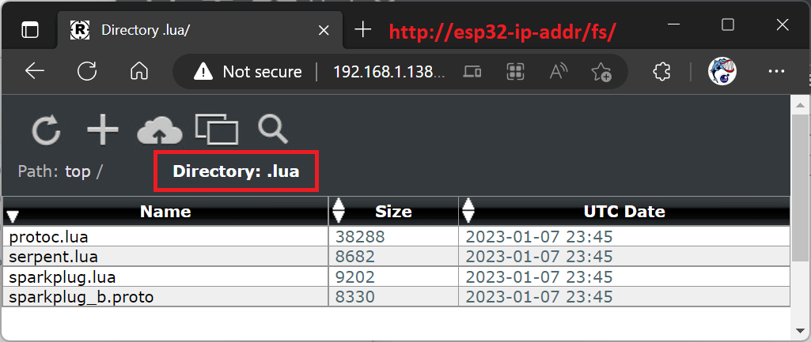

# Lua Sparkplug Library and Example

The Sparkplug specification is a set of guidelines for standardizing MQTT pub/sub communication in the Industrial Internet of Things (IIoT) industry. It defines a unified MQTT topic namespace and outlines how metrics are encoded and decoded using Google's Protocol Buffers. By following the Sparkplug specification and using this easy to use Sparkplug library, you can ensure that your MQTT-based IIoT applications are interoperable and able to seamlessly communicate with other systems.

- [What is MQTT Sparkplug](#what-is-mqtt-sparkplug)
- [Lua Sparkplug Introduction](#lua-sparkplug-introduction)
- [The Sparkplug Lua API](#the-sparkplug-lua-api)
- [Running the Provided Example "as is" using the Mako Server](#running-the-provided-example-as-is-using-the-mako-server)
- [Adding the Sparkplug module to the Mako Server's resource file](#adding-the-sparkplug-module-to-the-mako-servers-resource-file)
- [Compiling your own Sparkplug enabled BAS server](#compiling-your-own-sparkplug-enabled-bas-server)
- [RTOS example: Compiling and integrating with ESP32 firmware](#rtos-example-compiling-and-integrating-with-esp32-firmware)
  - [Sparkplug Enabled Weather Station](#sparkplug-enabled-weather-station)

## What is MQTT Sparkplug

The [Sparkplug specification](https://www.eclipse.org/tahu/spec/sparkplug_spec.pdf)(140 pages long) provides a detailed explanation of what Sparkplug is, but the key points to know are as follows:

The specification provides guidelines for designing a topic namespace, packaging message payloads, and managing application state in MQTT-based systems for the industrial sector. It includes a topic namespace structure, a mechanism for state management using birth and last-will messages, and a payload structure using Google Protocol Buffers. The specification does not change MQTT itself, but rather defines aspects of it that were left open for the end user to decide on. The Sparkplug infrastructure includes an MQTT broker, a management application, and MQTT Edge of Network Nodes (EoN).

Note that the specification also includes devices not capable of using Sparkplug directly, but we will not cover this extra complexity as most devices will be able to operate as EoN nodes directly. For example, a [low cost ESP32](https://realtimelogic.com/downloads/bas/ESP32/) programmable in the [easy to use and high level Lua language](https://realtimelogic.com/products/lua-server-pages/) can operate directly as EoN; thus the complexity in the EoN to device proxying will in most cases not be needed.

The management application, called the Primary Application, is a SCADA/IIoT Host Node that receives data from Sparkplug EoN nodes and sends control information to them. The device topic addressing includes a namespace, group_id, message_type, and edge_node_id. The namespace is now 'spBv1.0', thus a complete namespace looks like the following:

`spBv1.0/group_id/message_type/edge_node_id`

The message_type can be:

- NBIRTH - Birth certificate for EoN nodes. Sent when EoN starts or when requested by Primary Application via NCMD.
- NDEATH - Death certificate for EoN nodes. Packaged as an MQTT last-will message when sending the MQTT connect message to the MQTT broker.
- NDATA - Node data message. Metrics published by EoN nodes and received by Primary Application.
- NCMD - Node command message. Primary Application sending a command to an EoN.
- STATE - Critical application state message. Primary Application broadcasting on/off state (off via last-will message).

The Sparkplug specification provides a clear and consistent structure for topic addressing, making it easier for developers and planners to design systems that are interoperable. The use of Google Protocol Buffers for the payload structure ensures efficient encoding and decoding of data, while the state management mechanism using birth and last-will messages allows for the tracking of nodes in the network. Additionally, the use of retained messages and last-will testament messages allows for the broker to maintain the state of the entire Sparkplug infrastructure.


## Lua Sparkplug Introduction

The following components are required in order to design a so-called Sparkplug compatible Edge of Network Node (EoN):

1. [MQTT Client library](https://realtimelogic.com/ba/doc/?url=MQTT.html)
2. [Google's protocol buffers](https://en.wikipedia.org/wiki/Protocol_Buffers) library
3. Some understanding of the [Sparkplug specification](https://bit.ly/mqtt-sparkplug)

**However**; you will need minimal knowledge of MQTT, protocol buffers, and the Sparkplug specification when using the Sparkplug library included in this example as long as you use simple metrics. All the information you need is included in the following instructions. The Sparkplug library is designed for the [Barracuda App Server](https://realtimelogic.com/products/barracuda-application-server/) and provides a [Lua](https://en.wikipedia.org/wiki/Lua_(programming_language)) API; thus basic Lua experience is required. See our [interactive Lua tutorial](https://tutorial.realtimelogic.com/Lua-Types.lsp) if you are new to Lua.

Google's Protocol Buffers (Protobuf) requires a schema that defines the message types to be encoded and decoded. The [Sparkplug Protobuf schema](EoN/.lua/sparkplug_b.proto) is included in this example. When using Protobuf from a compiled language such as C/C++, a Protobuf compiler is required. This compiler generates stub code from the schema that enables C/C++ code to encode/decode Protobuf messages using the generated C code API. You do not need to use the Protobuf compiler when using Lua since Lua represents decoded Protobuf messages as [Lua tables](https://realtimelogic.com/ba/doc/en/lua/man/manual.html#3.4.9) . When encoding a message, you simply create a Lua table conforming to the Sparkplug schema and encode the table using APIs provided by this Sparkplug Lua library. You can manually create the Lua tables or you can use the provided Sparkplug library to help create simple metrics. The following Lua example shows how to create a Sparkplug message with one metric.

``` lua
local sparkplugPayload = {
  metrics = {
    {
      boolean_value = true,
      datatype = 11,
      name = "Node Metric2",
      timestamp = 1670455103012
    }
  },
  seq = 1,
  timestamp = 1670455103012
}
```

The above Sparkplug message (Lua table) can be created using the Sparkplug module as follows:

``` lua
local SP=require"sparkplug" -- Load the module
local DataTypes<const> = SP.DataTypes
local sparkplugPayload=SP.payload() -- Create Lua Sparkplug payload table
-- Add metric to payload
sparkplugPayload:metric("Node Metric2", DataTypes.Boolean, true)
```

As you can see from the above two examples, manually creating Lua tables requires a detailed understanding of the Sparkplug specification; however, the provided Sparkplug API greatly simplifies creating Sparkplug messages.

A Sparkplug EoN device sends metrics via an MQTT broker to a so-called Primary Application (the SCADA/IIoT Host Node). The Primary Application can also send command messages (NCMD) to the EoN node. The Sparkplug Lua module automatically converts received Protobuf messages to Lua tables. Each metric received will have one additional table element as shown in the following example:

``` lua
local sparkplugPayload = {
  metrics = {
    {
      boolean_value = true,
      datatype = 11,
      name = "Node Metric2",
      timestamp = 1670455113012,
      value = "boolean_value"
    }
  },
  seq = 5,
  timestamp = 1670455113012
}
```

Notice the extra `value` element inserted into the metric by the Protobuf decoder. This element simplifies reading received metrics as you can access the boolean_value without needing to specify the type name. The following prints `true` by accessing the member `metric.boolean_value` as follows: `print(metric[metric.value])`. This works since Lua table elements can be accessed as `table.membername` or as `table["membername"]` -- e.g.  `metric["boolean_value"]`.

## The Sparkplug Lua API

The Sparkplug module is loaded as follows:

``` lua
local SP=require"sparkplug" -- Load the module
local DataTypes<const> = SP.DataTypes
```

The second line above provides an easy way to access the various Sparkplug types. The most common types are Int8, Int16, Int32, Int64, UInt8, UInt16, UInt32, UInt64, Float, Double, Boolean, String, DateTime, and Text -- e.g.  DataTypes.Int8.

### Payload and Metrics API

Create a Sparkplug payload table.

`local payload=SP.payload()`

Add metrics to the payload table

`payload:metric(name, type [, value [, alias [, timestamp]]])`

Parameter name and type are required. The other are optional.
- name - the metric name
- type - the metric type e.g.DataTypes.Double
- value - the value; a Sparkplug null metric is created if this value is not set or is nil
- alias - Sparkplug includes a feature that enables you to shave off a few bytes for each metric sent
- timestamp - the time is set to the current time if not provided

Example: the following creates a null metric with a time set to zero (Jan 1, 1970)

`payload:metric("A long time ago", DataTypes.Boolean, nil, nil, 0)`

#### Add Dataset metrics to the payload table

A dataset is a matrix, with rows and columns.

`payload:dataset(name, set [,alias [,timestamp])`
- name - the metric name
- set - the columns, column name, and column type

**Example:**
``` lua
local ds=payload:dataset("My two columns",{
   {"My Int8s", DataTypes.Int8},
   {"My Int16s", DataTypes.Int16s}
})
```
The returned ds object includes one method:

`ds:row(...)`

Each row added must have the same set of columns as specified when calling `payload:dataset`

**Example:**

`ds:row(127, 32767)`

### Sparkplug API

The Sparkplug EoN stack is built on top of the [Lua MQTT Client](https://realtimelogic.com/ba/doc/?url=MQTT.html). A Sparkplug EoN instance is created as follows:

`local sp=SP:create(addr, onstatus, ondata, groupId, nodeName, nbirth [,op])`
- addr - the address is passed to the [MQTT stack](https://realtimelogic.com/ba/doc/?url=MQTT.html#create)
- onstatus - the onstatus callback is identical to the one required by the MQTT stack
- ondata - a callback that is called when the EoN receives STATE or NCMD sent by the Primary Application: `function ondata(cmd,data,topic)`
  - cmd - "STATE" or "NCMD"
  - data - Sparkplug payload presented as a Lua table
  - topic - the full MQTT topic name
- groupId - the Sparkplug group the device belongs to
- nodeName - the Sparkplug EoN node ID
- nbirth - a Lua Sparkplug payload table with all metrics the EoN can publish
- op - the MQTT stack's option table

#### Sparkplug instance methods:

Publish NDATA to the Primary Application

`sp:ndata(payload)`
- payload - a Sparkplug table that is either manually crafted or created using the metrics API

Resend the NBIRTH message.

`sp:nodebirth()`

The Sparkplug stack automatically sends the NBIRTH message when connecting to the MQTT broker. However, the NBIRTH message must be resent if the EoN node receives an NCMD with the metric name "Node Control/Rebirth". See the provided example for details.

## Running the Provided Example "as is" using the Mako Server

The included EoN example can be run "as is" using the [pre-compiled Mako Server](https://makoserver.net/download/overview/) , which includes all components required by the Sparkplug module.

### To run this example as is:
1. Download the [pre-compiled Mako Server](https://makoserver.net/download/overview/) for your platform and unpack the archive (Windows: self-extracting archive).
2. Run the example, using the Mako Server, as follows:

``` console
cd Sparkplug
mako -l::EoN
```

See the [Mako Server command line video tutorial](https://youtu.be/vwQ52ZC5RRg) for more information on how to start the Mako Server.

The example will attempt to connect to an MQTT broker at `localhost`. You can edit the example file EoN/.preload and change the URL to a public test broker, but we recommend that you use a local broker such as [Mosquitto](http://www.steves-internet-guide.com/install-mosquitto-linux/) or sign up for a free trial broker such as [HiveMQ Cloud](https://www.hivemq.com/mqtt-cloud-broker/). You also need a Sparkplug Primary Application; however, explaining this is beyond the scope of this tutorial. As a first step, connect the [MQTT Sparkplug sniffer](#the-sparkplug-sniffer) to the same broker.

#### The Sparkplug Sniffer

The Sparkplug Sniffer is a simple example that listens for Sparkplug messages and prints all messages received to the console. Run the Sparkplug Sniffer as follows (run another Mako Server instance).

``` console
cd Sparkplug
mako -l::SparkplugSniffer
```

## Adding the Sparkplug module to the Mako Server's resource file

The example code EoN/.preload includes the following code at the top of the file: [mako.createloader](https://realtimelogic.com/ba/doc/?url=Mako.html#mako_createloader)(io)

The above code makes it possible to load the Sparkplug module
EoN/.lua/sparkplug.lua from the application. However, for a more permanent
solution, copy the files to the Mako Server's resource file mako.zip as
follows:

``` console
mkdir .lua
cp EoN/.lua/sparkplug.lua .lua/
cp EoN/.lua/sparkplug_b.proto .lua/
zip -r -u path/2/mako.zip .lua
```


The above commands copy the sparkplug.lua module and the Sparkplug Protobuf schema to mako.zip/.lua/, which is where all pre-integrated modules are stored.

## Compiling your own Sparkplug enabled BAS server

The example can be run on a server that has been assembled by using the [Barracuda App Server Source Code Library](https://github.com/RealTimeLogic/BAS) (BAS) such as the [LSP Application Manager](https://realtimelogic.com/ba/doc/?url=lspappmgr/readme.html) designed for RTOS and the [Mako Server](https://realtimelogic.com/ba/doc/?url=Mako.html) designed for HLOS. However, the Sparkplug module requires a [Lua Protobuf module](https://github.com/surfskidude/lua-protobuf) not included in the BAS library. This library includes both C code and Lua code that must be integrated into the build. The following example shows how to include the Protobuf module when compiling the Mako Server included in the BAS repo:

``` console
cd /mnt/a
git clone https://github.com/RealTimeLogic/BAS.git
cd BAS/src/
git clone https://github.com/surfskidude/lua-protobuf.git
cd ..
make -f mako.mk
```

The makefile detects that we have the Protobuf module and includes the C file src/lua-protobuf/pb.c in the build. The makefile also adds the compile flag -DUSE_PROTOBUF=1, which enables the following code in examples/MakoServer/src/MakoMain.c:

``` lua
#if USE_PROTOBUF
luaL_requiref(L, "pb", luaopen_pb, FALSE);
lua_pop(L,1); /* Pop pb obj: statically loaded, not dynamically. */
#endif
```

The above C code pre-loads the Lua C Protobuf module at startup, which is
required when statically linking a module with the server.

The Lua Protobuf module also includes two Lua modules that must be found by
the Lua "require" function. The easiest way to deal with this is to add the
Lua code to the Mako Server's resource file mako.zip as follows:

``` console
mkdir .lua
cp src/lua-protobuf/protoc.lua .lua/
cp src/lua-protobuf/serpent.lua .lua/
cp ../Sparkplug/EoN/.lua/sparkplug.lua .lua/
cp ../Sparkplug/EoN/.lua/sparkplug_b.proto .lua/
zip -r -u mako.zip .lua
```

The above commands also copy the sparkplug.lua module and the Sparkplug Protobuf schema to mako.zip/.lua/

If you are building the LSP Application Manager for a monolithic RTOS system, follow the same copy commands as above, but copy the files to the .lua directory inside the examples/lspappmgr/obj/lsp.zip ZIP file. After copying the files, convert lsp.zip to C code using [bin2c](https://realtimelogic.com/downloads/bin2c/) as follows:

``` console
bin2c -z getLspZipReader lsp.zip LspZip.c
```

## RTOS example: Compiling and integrating with ESP32 firmware

While the tutorial below specifically uses an [ESP32](https://www.amazon.com/s?k=wrover), don't let that hold you back. The principles and setup can easily be adapted to your own RTOS device. And be sure to check out the [Barracuda App Servers GitHub repository](https://github.com/RealTimeLogic/BAS), where you will find detailed instructions on how to compile the software for other RTOS environments.


If you've been keeping up with the latest developments in technology, you've likely heard about the ESP32. This powerful WiFi device, powered by FreeRTOS and equipped with a wide range of GPIO and other peripherals, is an excellent platform for learning and creating low-cost sensors in mass quantities. Now, with the help of the Barracuda App Server, you can program the ESP32 using the easy-to-learn Lua programming language, even if you don't have any experience with C code. Whether you're a seasoned developer or just starting out, the ESP32 and the Barracuda App Server make it easy to bring your ideas to life.

The first step is to download our [SharkSSL IDE](https://realtimelogic.com/downloads/sharkssl/ESP32/?bas=) and follow the installation instructions. This IDE lets you compile and upload the Barracuda App Server to an ESP32 WROVER. As part of the installation process, it's important to upgrade the software using the [GitPullAll.sh shell script](https://realtimelogic.com/downloads/sharkssl/ESP32/?bas=#ssh). This will ensure that you are using the latest version of the software.

After upgrading, you will need to continue working in the web based command line shell to complete the setup. The following screenshot provides a visual representation of the software upgrade process.


Copy the following commands and paste the commands into the shell:

```
cd ~/LspAppMgr-ESP32/main/
git clone https://github.com/surfskidude/lua-protobuf.git
```

Once [lua-protobuf](https://github.com/surfskidude/lua-protobuf) has been cloned, navigate to the SharkSSL IDE by changing the browser URL from `http://ip-addr/shell/` to `http://ip-addr`. This will take you directly to the SharkSSL IDE interface.

To begin configuring the Barracuda App Server with lua-protobuf support, access the `CMakeLists.txt` file for the [LSP Application Manager](https://realtimelogic.com/ba/doc/?url=lspappmgr/readme.html) build. Using the navigation tree in the left pane of the SharkSSL IDE, click on `LSP Application Manager` -> `main`, and then double click on `CMakeLists.txt` to open the file in the built-in web editor. This file is responsible for instructing the esp-idf build environment on which C files to include and what compile options to use. Thus, we will need to add the necessary requirements for compiling lua-protobuf to this file.

1. In the `idf_component_register` macro, just after `SRCS`, add the following: `"lua-protobuf/pb.c"`
2. In the first `target_compile_options` macro, just after `PRIVATE`, add the following: `-DBP_IO=0 -DUSE_PROTOBUF`

The compile time macros disable the non compatible IO in lua-protobuf and registers the lua-protobuf installation hook in the LSP Application Manager (in ~/LspAppMgr-ESP32/main/BAS/examples/lspappmgr/src/LspAppMgr.c).


1. Save `CMakeLists.txt` by clicking the `Save` button
2. Double click on `main.c` in the left pane to open the C startup file
3. Click the `Compile` button to compile Barracuda App Server, the LSP Application Manager, and lua-protobuf

After making the necessary changes to the "CMakeLists.txt" file, you should be able to compile the firmware without any errors. The next step is to upload the firmware to the ESP32 board. To do this, follow the [firmware upload instructions](https://realtimelogic.com/downloads/sharkssl/ESP32/?bas=#upload) provided on the SharkSSL IDE page.

After the firmware is uploaded, the ESP32 should boot and you should see the Web File Manager link (http://esp32-ip-addr/fs/) being printed in the console. Navigate to this URL using your browser. Click on the `.lua` directory to navigate into this directory. This empty directory requires the files as shown in the screenshot below.



The files `protoc.lua` and `serpent.lua` comes from the lua-protobuf module and the files [sparkplug.lua](EoN/.lua/sparkplug.lua) and [sparkplug_b.proto](EoN/.lua/sparkplug_b.proto) comes from this example. Upload these 4 files to your ESP32 by dropping them on the Web File Manager browser window when in the .lua directory. These Lua modules and the protobuf schema file are required for the Sparkplug example to work. The LSP App Manager sets up the [Lua require path](https://realtimelogic.com/ba/doc/en/lua/man/manual.html#6.3) to include the .lua directory. Another option to include these files is explained in the above section [Compiling your own Sparkplug enabled BAS server](#compiling-your-own-sparkplug-enabled-bas-server), where the files are embedded in the firmware image (via lsp.zip). However, uploading them to the ESP32's file system is much easier.

You are now ready to run the Sparkplug example. To begin, use the LSP Application Manager to create a new application and directory for the example. For example, you can create a directory called "sparkplug" and name the application "sparkplug". Next, activate the `Running` switch to start the Sparkplug application and click the `Edit` button to open the web IDE. In the web IDE, double click on the `.preload` script and clear its contents. Then, open the [.preload script from this example's EoN directory](EoN/.preload) in an editor and copy all of its contents. Finally, paste the copied code into the web editor. Within the code in the web editor, locate the following line:

```
local mqttServer = "localhost"
```

You must change `localhost` to a public broker or to a broker running on your host computer as explained in the section [Running the example using the Mako Server](#running-the-provided-example-as-is-using-the-mako-server) above.

Once you have set the correct broker name, click the `Save` button, then click the `Restart` button to start the MQTT Sparkplug example. To view the Sparkplug data being sent, you can connect the [MQTT Sparkplug sniffer](#the-sparkplug-sniffer) to the same broker.

### Sparkplug Enabled Weather Station


There are many examples of ESP32 Weather Stations available online, however, this specific example stands out as it demonstrates how to send weather data as Sparkplug messages to a Primary Application. This allows for the weather data trend to be easily visualized and analyzed. It is a fun and practical example for those looking to send weather data from an ESP32 device to a primary application using the Sparkplug protocol.

See the [Weather Station Lua Source Code](WeatherStationEoN/.preload) for additional information.


