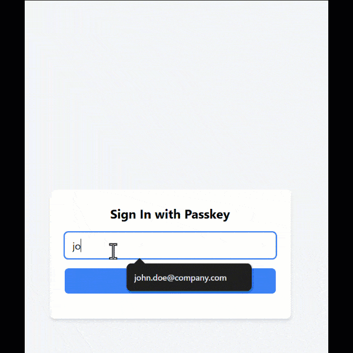

# BAS WebAuthn

The **BAS WebAuthn module** enables **WebAuthn authentication** for **embedded devices**, providing **passwordless, FIDO2-compliant security** for **IoT, industrial systems, and OEM products**. Designed for **resource-constrained environments**, BAS WebAuthn seamlessly integrates into **[Barracuda App Server](https://realtimelogic.com/products/barracuda-application-server/) (BAS)-powered OEM products**, ensuring **secure and scalable authentication**.

### Introduction
- [Why Biometric Authentication Is a Perfect Fit for Embedded Web Servers](https://realtimelogic.com/articles/FIDO2-amp-WebAuthn-for-Embedded-Web-Servers)

### **Key Benefits:**
- **Passwordless Security** - Eliminates passwords with **public-key cryptography**.
- **FIDO2 & WebAuthn Compliance** - Meets modern **authentication standards**.
- **Embedded Device Compatibility** - Optimized for **IoT and industrial deployments**.
- **Seamless Integration** - Works with any **BAS-powered product and application**.

By integrating **BAS WebAuthn**, developers can enhance **security, user experience, and compliance** in **embedded applications**, ensuring **future-proof authentication** for connected devices.


### **How WebAuthn Works**
- When a user registers, their **authenticator device** generates a **private-public key pair**.
- The **private key** remains securely stored on the **authenticator device** - e.g. your phone.
- The **public key** and **credential ID** are sent to the server.
- During authentication, the server uses the stored **public key** to verify the user's identity.

### **Security Benefits**
- **No Shared Secrets:** The server stores **no private or sensitive data**, reducing attack vectors.
- **Resistant to Device Reverse Engineering:** Public keys are useless to hackers without their corresponding private keys.

### **Browser Support**
WebAuthn is supported on all major browsers, including **Chrome, Firefox, Edge, and Safari**.


## WebAuthn Introduction, Tutorial, and Client Side JavaScript Library

- [WebAuthn.io](https://webauthn.io/)
  A live WebAuthn demo that allows users to test WebAuthn authentication in their browser.

- [WebAuthn Guide](https://webauthn.guide/)
  A comprehensive beginner-friendly tutorial/guide to WebAuthn, explaining key concepts.

- [SimpleWebAuthn Browser SDK](https://simplewebauthn.dev/docs/packages/browser)
  The **SimpleWebAuthn** browser package provides an easy-to-use JavaScript API for implementing **WebAuthn authentication**. The **[BAS WebAuthn REST API](WebAuthn.md#bas-webauthn-rest-api)** is fully compatible with **SimpleWebAuthn**.

While you can use the browser's native **WebAuthn API** directly, binary values sent from the server are **Base64-encoded** and must be **decoded** before invoking the native API. **SimpleWebAuthn** handles this decoding automatically, simplifying the integration process and making it easier to work with the native WebAuthn API.

# **WebAuthn Examples**

While WebAuthn is a complex technology, we have simplified its integration and provided **two examples** to accelerate your learning. These ready-to-run examples are designed for the [Mako Server](https://makoserver.net/), a BAS-powered application server.

- **Example 1** is functionally identical to the demo at [webauthn.io](https://webauthn.io/) and introduces the technology.
- **Example 2** is a more practical example, designed as a foundation for integrating WebAuthn into your product.

WebAuthn can be deployed on both **public servers** on the Internet and **private Intranet servers**. The most common scenario for **BAS-powered OEM products** is **Intranet deployment**, and this tutorial concludes with guidance on meeting WebAuthn requirements in such environments.

---

## **Example 1 - WebAuthn Introduction**

### **Getting Started**
1. First, ensure you can successfully **register and authenticate** on the online [webauthn.io](https://webauthn.io/) demo.
2. Then, [download the Mako Server](https://makoserver.net/download/overview/) and [clone this LSP Examples repository](https://github.com/RealTimeLogic/LSP-Examples).
3. Start the Mako Server with the following commands:

```sh
   cd LSP-Examples/WebAuthn
   mako
```

The above commands start the Mako Server in the WebAuthn folder, which makes the Mako Server load the included `mako.conf` configuration file. This file instructs the server to load two applications:

- **WebAuthnModule** - Includes the **generic WebAuthn Lua module webauthn.lua**, which should be included in your own product.
- **example1** - The example WebAuthn implementation.

For detailed instructions on starting the Mako Server, refer to:

- Our **[command-line video tutorial](https://youtu.be/vwQ52ZC5RRg)**
- The **[Mako Server command-line options](https://realtimelogic.com/ba/doc/en/Mako.html#loadapp)** in our documentation.

### **Accessing the Example**
Once the Mako Server is running:

- Open a browser and navigate to **`http://localhost`** or **`http://localhost:portno`**, where `portno` is the listening port printed in the console.
- We **recommend allowing the server to open default ports 80 and 443**, as some instructions below assume the Mako Server is listening on these port numbers.
- Proceed by replicating the commands seen below:
  


### **How Example 1 Works**

This example does not implement server-side authentication or a custom authenticator. However, it demonstrates the full **WebAuthn registration and authentication flow** using cryptographic mechanisms.

- After logging in, **refreshing the browser will require re-authentication**, as no session is maintained.
- The authentication process follows the standard WebAuthn steps, ensuring a **secure, passwordless login experience**.

#### **Understanding the Implementation**
- The application's **startup script**, found in [example1/.preload](example1/.preload), initializes a **WebAuthn instance** and provides the three required WebAuthn callbacks.
- For example, the **`authenticate` callback** is triggered only **after successful cryptographic verification**. If authentication fails, this callback is **not called**.
- In a real-world scenario, this callback would be responsible for handling **server-side login**.

#### **Next Steps**
- Test several usernames and pay attention to the printouts from `.preload` in the server's console window.
- Study the **JavaScript code** in [example1/index.html](example1/index.html) to understand how the client interacts with WebAuthn.
- Refer to [WebAuthn Guide](https://webauthn.guide/) for a deeper understanding of the WebAuthn flow.
- The [server-side WebAuthn Module](WebAuthn.md) is documented separately.

---
## **Example 2 - A Complete WebAuthn Demo**

Example 2 demonstrates a **fully functional WebAuthn authentication flow**, including **user registration, email verification, and login**.

1. The user **registers**.
2. The server **sends a confirmation email**.
3. The user **clicks the confirmation link** to finalize registration.
4. The user can then **log in** securely.

### **A Note On Authentication Design**
While **BAS WebAuthn** does **not require email-based registration**, using **email addresses as usernames** can simplify application design. Alternative workflows include:
- Instead of sending a confirmation email to the user, an **administrator could receive the email or notification** via another channel.
- The administrator **approves the user manually**.
- The **BAS WebAuthn module includes a server-side API** that enables user approval using the **registration URL**, allowing systems to function **without email-based verification**.

### **Configuring, Running, and Using Example 2**
1. **Modify the Mako Server Configuration File**
   - Open **`mako.conf`** in an editor.
   - Change **`activeExample`** from `"example1"` to `"example2"`.
   - Set the **email** and **email password** fields, **Note:**
        - The include `mako.conf` file includes configuration set for **Gmail SMTP**, but any SMTP provider can be used.
        - **For Gmail users:**
          - Do **not** use your regular Gmail password.
          - You must generate a **Gmail App Password**.
          - Follow the tutorial: How to Send Emails with Xedge, section [how to generate a Gmail App Password](https://realtimelogic.com/articles/How-to-Send-Emails-with-Xedge-IDE-A-StepbyStep-Guide#smtp).

2. **Ensure Internet Access**
   - The **Mako Server must have internet access** for Example 2 to function properly.
   - If running in an **offline environment or behind a proxy firewall**, you must manually copy the **registration link** printed to the console and enter it into the browser.

3. **Reset the User Database**
   - After saving `mako.conf`, **delete the WebAuthn user database (`WebAuth.userdb`)** generated by Example 1.
4. **Clear the browser cache**
   - The cache must be cleared to ensure you are not using the index.html file from example 1.
5. **Restart the Mako Server**
   - Hit Ctrl-C and start the server again
6. **Register**
   - Open a browser and navigate to **`http://localhost`**.
   - Register using your **email address**.
   - **Check your email** for a confirmation link.
      - If email is not configured, **copy the registration URL** printed in the console.
  - Click the link in the email **or** paste the copied URL into your browser.
  - **Registration is now complete!**


6. **Logging In and Logging Out**

    After logging in, you should see an **"Authentication Successful"** message, followed by the **main `index.html` file** loading shortly after.

    **Protected Resources**

    You can add **additional web pages** and **subdirectories** to the `example2` folder. All files and resources within this directory **will be protected** by WebAuthn authentication.

    **Testing with the Web File Server**
    
    To simplify testing, a [**Web File Server**](https://realtimelogic.com/ba/doc/en/lua/lua.html#ba_create_wfs) is included and available at **`fs/`**.
    - The **main `index.html` file** includes a link to **`fs/`**.
    - Use the **Web File Server** and navigate to a directory on your computer.
    - Click the **Logout button** inside the Web File Server.
    - You will see the **login page**, at the same URL you were on before logging out.
    - Click the **Log In button** again.
    - You should now see the **same folder** in the Web File Server.

### Example 2 Files

- **`.preload`** - The application's **startup script**. Initializes a **WebAuthn instance**, sets up **server-side authentication logic**, and creates a **Web File Server instance**.
- **`.login.lsp`** - The **login page**. If a user is not authenticated, the authentication logic in `.preload` forwards all requests to this page.
- **`.RegEmail`** - The **registration email template**.
- **`registered.shtml`** - **registered welcome message**.  After the user clicks the **registration URL**, the WebAuthn **`registered`** callback in `.preload` forwards the request to this page.
- **`index.html`** - Displays a **welcome message** at `/` if the user is authenticated.
- **`logout.lsp`** - Activated when the **logout button** is clicked in the Web File Server.
- **`help.lsp`** - Activated when the **help button** is clicked in the Web File Server.


## **WebAuthn Requirements**

WebAuthn has strict security requirements that must be met for proper operation:

- **Trusted HTTPS is required**
   - WebAuthn mandates a **secure TLS (`https://`) connection** to protect against **man-in-the-middle (MITM) attacks**.
   - **WebAuthn will not function** if there are **TLS certificate errors** (e.g., self-signed or untrusted certificates).

- **A valid domain name is required**
   - WebAuthn **does not work with IP addresses**.
   - The **Relying Party ID (`rp.id`) must be a registered domain name**.

- **Local Development Exception**
  - The only exception to these rules is **`http://localhost`**, which allows developers to test WebAuthn locally **without HTTPS or a valid certificate**.

### **Easily Meeting WebAuthn Requirements**

[**SharkTrustX**](https://realtimelogic.com/services/SharkTrust/) simplifies WebAuthn compliance by providing both **DNS services** and **automatic installation of trusted certificates** for Intranet servers.

If you followed the configuration instructions for Example 2, the **Mako Server** should already be set up with a **trusted certificate**. The assigned **domain name** and **X.509 certificate details** are printed in the **Mako Server's console window**.

#### **Finding Your Server**
1. Navigate to **[https://local.makoserver.net/](https://local.makoserver.net/)**.
2. You should see a **link to your local Mako Server instance**.
3. Clicking this link allows you to **register and authenticate** with your Intranet server using a **trusted domain name**.

#### **Important Note**
Since this setup provides a **new domain name**, you will need to **re-register your credentials** before using WebAuthn authentication.

By leveraging **SharkTrustX**, you can seamlessly deploy WebAuthn on **Intranet servers** without creating your own complex DNS and PKI.

## The BAS WebAuthn Module's API

- [WebAuthn.md](WebAuthn.md)
