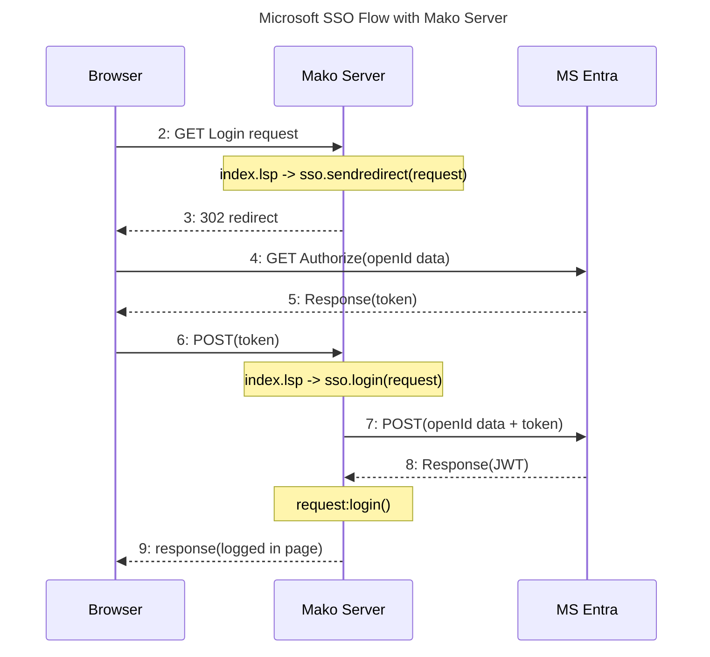

# Single Sign-On (SSO) with OpenID Connect for Microsoft Entra ID

This example shows how to implement Single Sign-On (SSO) using
[OpenID Connect](https://openid.net/connect/). The example is designed
specifically for [Microsoft Azure](https://portal.azure.com/) Entra ID.

Shipping products with pre-installed passwords creates a major
security vulnerability - essentially setting up a "backdoor" into your
system.  Implementing SSO can mitigate this risk by allowing users to
access multiple applications or services with a single set of
credentials that are not stored on the device. By centralizing the
authentication process, SSO not only makes it more challenging for
unauthorized individuals to gain access but also simplifies account
management and monitoring for system administrators.  This approach
significantly enhances overall system security and integrity.

>For an introduction to SSO, check out:
>
>1.  [Single Sign On for Embedded
>    Devices](https://www.linkedin.com/pulse/benefits-active-directory-single-sign-on-embedded)
>2.  [Xedge](https://realtimelogic.com/ba/doc/en/Xedge.html#auth) --
>    which includes an easy-to-use web interface that enables Microsoft
>    Entra ID Single Sign-On as an option.


## Azure Instructions

Follow these steps to configure your application in the Azure portal:

1.  Open the [Azure portal](https://portal.azure.com/) and click on the
    **Azure Active Directory** icon.
2.  In the left pane, click the hamburger-menu and then select
    **Microsoft Entra ID**.
3.  At the top of the page, click **Add -\> App Registration**.
4.  Enter a suitable name for your application.
5.  Set the account type to **Single tenant** (in most cases).
6.  Click on **Select a platform** and choose **Web**.
7.  For the redirect URI, include all relevant sites (e.g., test sites).
    For testing purposes, you can use `http://localhost`.
8.  Click **Register** at the bottom of the page.
9.  On the following page, copy and save both the **Application (client)
    ID** and the **Directory (tenant) ID**.
10. In the left pane, click **Certificates & secrets** and then click
    **New client secret**.
11. Provide a name for your client secret.
12. Choose an appropriate expiration date for the secret.
13. Click **Add** at the bottom of the page.
14. Immediately copy the **client secret Value** - you won't be able to
    see this value again.
15. Insert the **Directory (tenant) ID**, **Application (client) ID**,
    and **client secret Value** into your `mako.conf` file (details below).

## Granting Users Access

Once your application is set up, grant access to individual users within
your organization by following these steps:

1.  In the Azure portal, click **View** below the **Manage Microsoft
    Entra ID** icon.
2.  Search for and select the application you just registered.
3.  Click on **Assign users and groups**.
4.  Click **+ Add user/group** and then click the link below **Users**.
5.  Check the users you want to grant permission to and click **Select**
    at the bottom of the page.

Users granted access will now be able to sign in and use the application
based on the permissions and roles assigned to them.

For additional details, refer to the Microsoft tutorial: [Register an
application with the Microsoft identity
platform](https://docs.microsoft.com/en-us/azure/active-directory/develop/quickstart-configure-app-expose-web-apis).
When you\'re ready, proceed to the [next
tutorial](https://docs.microsoft.com/en-us/azure/active-directory/develop/quickstart-configure-app-access-web-apis),
which includes the section on [adding permissions to access Microsoft
Graph](https://docs.microsoft.com/en-us/azure/active-directory/develop/quickstart-configure-app-access-web-apis#add-permissions-to-access-microsoft-graph).

## How to Run the Example

1.  Open your preferred editor and create the file
    `LSP-Examples/fs-sso/mako.conf`.

2.  Copy and paste the following into `mako.conf`:

```
openid={
   tenant="your tenant id",
   client_id="your client id",
   client_secret="your client secret",
   redirect_uri="http://localhost/"
}
```

3.  Replace the placeholder values with your actual Microsoft Entra ID
    settings. For testing on localhost, keep the `redirect_uri` as shown
    above.

    The Microsoft Entra ID values specified in `openid` remain unchanged, with the exception of the `client_secret`. The client secret expires after a maximum of two years. This application is designed to dynamically handle this condition. When the client secret nears expiration, the login page will prompt the user to enter a new value.

    >In this example, the new client secret is stored only in memory. In a production environment, you would need to persistently save this updated value. For instance, [Xedge](https://realtimelogic.com/ba/doc/en/Xedge.html) securely stores the updated client secret after the user provides it.

4.  Save `mako.conf` and run the example using the Mako Server:

    ``` bash
    cd LSP-Examples/fs-sso
    mako -l::www
    ```

For detailed instructions on starting the Mako Server, check out our
[command line video tutorial](https://youtu.be/vwQ52ZC5RRg) and review
the server\'s [command line
options](https://realtimelogic.com/ba/doc/?url=Mako.html#loadapp) in our
documentation.

> **Warning:** If the Mako Server cannot find `mako.conf` or if the
> `openid` settings in the file are incorrect, you will receive an
> error message.


Once the Mako Server is running, navigate to `http://localhost` and
click the **Login** button. You should be prompted to log in using
Microsoft Entra ID and will gain access if your Microsoft Entra App is
configured correctly.

After loging in you will be able to access the Web File Manager by clicking the `File Server` button.


### Session URL

Client applications, such as [WebDAV](https://realtimelogic.com/products/webdav/), that cannot use Single Sign-On can still be granted access by creating a session URL. The code in the `.preload` file sets this up. After logging in, you should see a session URL. You can then copy this URL and test it in another browser that isn't authenticated; you should be able to access all the resources without having to authenticate.

#### WebDAV

Use the session URL to access the WebDAV server with your preferred WebDAV client. For guidance on mounting or mapping a WebDAV server, check out the [WebDAV mount tutorial video](https://youtu.be/i5ubScGwUOc). When mounting or mapping, simply use the session URL provided during your login session.

#### Session URL Security

A session URL is essentially a secret key that grants access to authenticated resources. Because it functions as a token, its security is paramount. However, this secret is not inherently protected by any encryption unless you ensure that it's transmitted over a secure HTTPS connection.

Without HTTPS, the session URL could be intercepted or exposed, potentially giving unauthorized users access to your system.


## Files

## Files Overview

This section details the key files in the `LSP-Examples/fs-sso/www` directory and explains their roles in the Single Sign-On (SSO) example application.

- **.preload**:
  This application startup file is responsible for loading the `ms-sso.lua` module. It also creates the authenticator and initializes the Web File Manager (WFS), setting up the core SSO functionality for the application.

- **index.lsp**:
  This LSP file manages the login user interface. It serves as the primary entry point where users are prompted to log in, enabling them to access protected resources.

- **help.lsp**:
  Invoked by the Web File Manager (WFS), this file is linked to the Help button in the UI.

- **logout.lsp**:
  Also part of the Web File Manager (WFS), this file handles the logout button functionality.

### The SSO Module

- **ms-sso.lua** (located in the `.lua` subdirectory):
  This generic SSO module encapsulates the Single Sign-On logic used across the application. Designed for reusability, it simplifies the integration of SSO by handling core authentication tasks, making it easy to incorporate into your own projects.


## The SSO Module's API

Before diving into the API details, let's review the complete messaging sequence, which illustrates how the browser, the Mako Server, and Microsoft Entra (MS Entra) interact during the login process.



**Diagram Explanation:**

1. **Login Request:** The browser sends a GET request for the login page to the Mako Server (Step 2).
2. **Redirect:** The Mako Server's index.lsp file calls `sso.sendredirect(request)` , which then returns a 302 redirect (Step 3) to the MS Entra authorization endpoint.
3. **Authorization:** The browser follows the redirect and sends a GET request to MS Entra with the OpenID data (Step 4).
4. **Token Response:** MS Entra responds with an authentication token (Step 5).
5. **Token Submission:** The browser submits this token back to the Mako Server via a POST request (Step 6).
6. **Validation:** In response, index.lsp calls `sso.login(request)` . The Mako Server then forwards the token and OpenID data to MS Entra (Step 7).
7. **JWT Receipt:** MS Entra returns a JWT to the Mako Server (Step 8), which decodes it and completes the login process (Step 9).

For more details, refer to the [MS Entra API documentation](https://docs.microsoft.com/en-us/azure/active-directory/develop/) for information on token generation and validation.

### SSO Module Initialization

The SSO module is loaded using:

```lua
ssoModule = require "ms-sso"
```

This returns a table with a single `init` function. You initialize the SSO module by calling:

```lua
sso = ssoModule.init(openid, login [, log])
```

#### Arguments:

* **openid**

    A configuration table containing the same settings as the `openid` table defined in your mako.conf. These settings include the tenant ID, client ID, client secret, and redirect URI required for MS Entra authentication.

* **login**

    The path to the login page. In this example, it is set to `/` , which loads index.lsp.

* **log** (optional)

    A logging function ( `log(message)` ) for sending log output. If this function is not provided, logging defaults to the server trace.

### Function table returned by ssoModule.init()

* ``` sso.validate(client_secret)```
  Checks if the Microsoft Entra ID's client secret has expired. If it has, you can call this function to set a new secret.
    
    **Return Value:**
    
    * **true:** if the new client secret is accepted.
    * **false:** if the client secret is **not** accepted.

* ``` sso.sendredirect(request)```
  This function is called by the login page (index.lsp) when the user clicks the login button. It initiates the SSO flow by sending the appropriate redirect to the browser. This function does not return a value; it only initiates the redirection.

* ``` sso.login(request)```
  This function must be called after the browser receives the authentication token from MS Entra. It decodes the JWT token received from MS Entra and cryptographically validates the data.

    **Return Values:**

    * **On Success:**
      - `header, payload` - The decoded JWT header and payload received from MS Entra.
    * **On Error:**
      - `nil, errorMessage, errorCodes`
         + **errorMessage:** A string detailing the error, which can be presented to the user.
         + **errorCodes:** An array of [error codes](https://learn.microsoft.com/en-us/entra/identity-platform/reference-error-codes) returned by MS Entre. The index.lsp example page manages the two error codes 7000215 and 7000222 related to invalid client secret.
