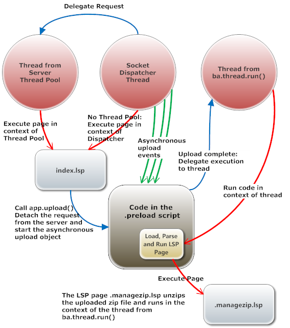

# Asynchronous Upload

This example shows how to use [ba.create.upload()](http://realtimelogic.com/ba/doc/?url=en/lua/lua.html#ba_create_upload) for creating an upload directory object, which can accept a large number of concurrent uploads.



Run the example, using the Mako Server, as follows:

```
cd upload/blocking
mako -l::www
```

