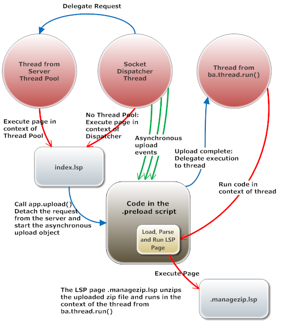

# Asynchronous Upload

## Overview

This example shows how to use [ba.create.upload()](http://realtimelogic.com/ba/doc/?url=en/lua/lua.html#ba_create_upload) to create an upload directory object that can handle a large number of concurrent uploads.



## Files

- `www/.preload` - Creates and configures the upload directory object.
- `www/index.lsp` - Serves the upload UI and forwards non-`GET` requests into `app.upload(request)`.
- `www/upload.js` - Browser-side drag-and-drop upload logic.
- `www/.managezip.lsp` - Additional upload-management logic.
- `www/doc/README.html` - Companion HTML documentation included with the example.

## How to run

Start the example with the Mako Server:

```bash
cd upload/asynchronous
mako -l::www
```

For more detail on starting the Mako Server, see the [command line video tutorial](https://youtu.be/vwQ52ZC5RRg) and the [command line options documentation](https://realtimelogic.com/ba/doc/?url=Mako.html#loadapp).

## How it works

`index.lsp` serves a regular upload form for browsers that do not use drag and drop, and it also exposes the drag-and-drop UI used by `upload.js`. Any non-`GET` request is handed to the upload object created in `.preload`, which processes the incoming upload asynchronously. That separation lets the app keep the browser UI simple while the upload directory object manages the concurrent upload workload.

## Notes / Troubleshooting

- This example is more complex than the blocking example and is best used when you truly need high upload concurrency.
- If you want the simpler request-driven version, start with `../blocking/`.
