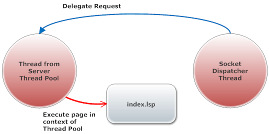

# Blocking (Easy) Upload

## Overview

This example shows how to implement uploads with the simpler blocking request APIs:

- [request:rawrdr()](https://realtimelogic.com/ba/doc/?url=lua.html#request_rawrdr) for drag-and-drop upload
- [request:multipart()](https://realtimelogic.com/ba/doc/?url=lua.html#request_multipart) for standard HTML form upload

These APIs are easier to understand than the asynchronous variants, but they require a thread-enabled server such as the Mako Server.



## Files

- `www/.preload` - Startup logic for the blocking upload example.
- `www/index.lsp` - Main upload page.
- `www/upload.js` - Browser-side drag-and-drop helper.
- `www/.managezip.lsp` - Additional upload-management logic.
- `www/doc/README.html` - Companion HTML documentation included with the example.

## How to run

Start the example with the Mako Server:

```bash
cd upload/blocking
mako -l::www
```

For more detail on starting the Mako Server, see the [command line video tutorial](https://youtu.be/vwQ52ZC5RRg) and the [command line options documentation](https://realtimelogic.com/ba/doc/?url=Mako.html#loadapp).

## How it works

The page accepts two upload styles from the browser. Standard form uploads are handled through `request:multipart()`, while drag-and-drop uploads use `request:rawrdr()`. Because the request is processed directly in the page flow, this version is easier to study than the asynchronous upload object example.

## Notes / Troubleshooting

- Use this version first unless you need to support many uploads at the same time.
- Because the example uses blocking request APIs, it should run on a server that supports threaded request handling.
